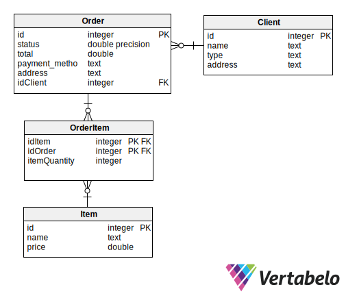

# Order Management System

A console-based order management application with a [Terminal.GUI](https://github.com/gui-cs/Terminal.Gui) interface and SQLite database via Entity Framework Core.

**Key Features**:
- 🧪 **Unit tested** with EF Core In-Memory provider
- 🖥️ **Terminal.GUI** interface (keyboard/mouse supported)
- ⌨️ **Alt+Key** menu shortcuts
- 🗃️ **SQLite database** for persistent storage
- 📦 **Order Management**:  
  ➕ Create | 🗑️ Delete | 🔍 List | 🚚 Ship | 🏭 Forward to Warehouse
- 👥 Client & Item creation
- 💼 Entity Framework Core data layer

**Implements**: All required business logic/validation from the assignment specification.

**Schema of the database used:**  

